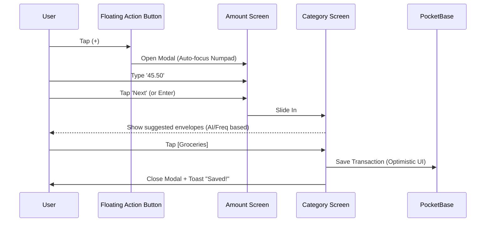

# Design Mockups: Hybrid Budgeting UI

## 1. Envelope Card Design

The "Envelope" is the core unit of the budgeting system. It needs to be instantly readable and provide "Safe to Spend" status at a glance.

### Visual Wireframe (Standard State)

```text
+-------------------------------------------------------+
|  [ ICON ]  Groceries                          $150.00 |  <-- "Safe to Spend" (Green if > 0)
|                                                       |
|  [==========================              ]           |  <-- Progress Bar (70% filled)
|                                                       |
|  Spent: $350.00                       Limit: $500.00  |
+-------------------------------------------------------+
```

### Visual Wireframe (Hidden/Private State)

```text
+-------------------------------------------------------+
|  [ LOCK ]  Private Envelope                           |
|                                                       |
|  [////////////////////////////////////////]           |  <-- Blurred/Greyed out progress
|                                                       |
|  Tap to Reveal                                        |
+-------------------------------------------------------+
```

### Tailwind CSS Recommendations

We'll use the project's semantic tokens (presumed based on `baseline-ui` and standard practices).

**Container**:
`bg-card text-card-foreground rounded-xl border border-border shadow-sm p-4 relative overflow-hidden`

**Header**:
- **Name**: `font-semibold text-lg flex items-center gap-2`
- **Safe Amount**: `font-bold text-xl tabular-nums`
  - Color Logic: `text-emerald-600` (Safe) vs `text-rose-600` (Overbudget)

**Progress Bar**:
- **Track**: `h-3 w-full bg-secondary rounded-full mt-3 mb-1 overflow-hidden`
- **Fill**: `h-full rounded-full transition-all duration-500`
  - Color Logic:
    - < 80%: `bg-primary`
    - 80-99%: `bg-amber-500`
    - 100%+: `bg-rose-500`

**Meta Info (Footer)**:
`flex justify-between text-sm text-muted-foreground font-medium mt-2`

### Component Logic (React Pseudo-code)

```tsx
const EnvelopeCard = ({ name, icon, spent, limit, isPrivate, isRevealed }) => {
  const safeToSpend = limit - spent;
  const progress = Math.min((spent / limit) * 100, 100);

  if (isPrivate && !isRevealed) {
    return (
      <div className="bg-card/50 border border-dashed border-border p-4 rounded-xl flex items-center justify-center gap-2 text-muted-foreground">
        <LockIcon className="w-5 h-5" />
        <span className="italic">Hidden Envelope</span>
      </div>
    );
  }

  return (
    <div className="bg-card text-card-foreground rounded-xl border border-border shadow-sm p-4">
      {/* Header */}
      <div className="flex justify-between items-start">
        <div className="flex items-center gap-2">
          <Icon name={icon} className="w-6 h-6 text-primary" />
          <h3 className="font-semibold text-lg hover:underline cursor-pointer">{name}</h3>
        </div>
        <div className={cn("text-xl font-bold", safeToSpend >= 0 ? "text-emerald-600" : "text-rose-600")}>
          ${safeToSpend.toFixed(2)}
        </div>
      </div>
      
      {/* Progress */}
      <div className="relative pt-4 pb-2">
        <div className="h-3 w-full bg-secondary rounded-full overflow-hidden">
          <div 
            className={cn("h-full transition-all", getProgressColor(progress))} 
            style={{ width: `${progress}%` }} 
          />
        </div>
      </div>

      {/* Footer */}
      <div className="flex justify-between text-xs text-muted-foreground uppercase tracking-wide font-medium">
        <span>Spent: ${spent}</span>
        <span>Limit: ${limit}</span>
      </div>
    </div>
  );
}
```

---

## 2. Mobile Quick-Add Flow

**Goal**: Zero friction. Capture a transaction in < 3 seconds while walking out of a store.

### User Flow (Mermaid)



### Screen 1: The "Calculator" Input

Everything is reachable with one thumb.

```text
+-----------------------------------+
|  [X] Cancel                       |
|                                   |
|           $45.50                  |  <-- Large, high-contrast text
|                                   |
|  +-----+ +-----+ +-----+          |
|  |  1  | |  2  | |  3  |          |
|  +-----+ +-----+ +-----+          |
|  |  4  | |  5  | |  6  |          |
|  +-----+ +-----+ +-----+          |
|  |  7  | |  8  | |  9  |          |
|  +-----+ +-----+ +-----+          |
|  |  .  | |  0  | |  <- |          |
|  +-----+ +-----+ +-----+          |
|                                   |
| [      NEXT >      ]              |  <-- Full width bottom button
+-----------------------------------+
```

### Screen 2: The "Smart Selector"

Uses "Smart Chips" sorted by:
1.  **Geolocation** (e.g., if at Costco -> suggest Groceries) - *Future Feature*
2.  **Frequency** (Groceries is most common)
3.  **Time of Day** (Lunch time -> Dining Out)

```text
+-----------------------------------+
|  < Back             $45.50        |
|                                   |
|  Select Envelope:                 |
|                                   |
|  [ Groceries  ]  [ Dining Out   ] |  <-- Large tap targets (Pills)
|  [ Gas        ]  [ Household    ] |
|                                   |
|  Other:                           |
|  [ Gifts      ]  [ Personal     ] |
|  [ Savings    ]  ...              |
|                                   |
|  [ Date: Today ] [ Note... ]      |
|                                   |
| [      SAVE TRANSACTION    ]      |
+-----------------------------------+
```

### React/Tailwind Implementation Notes

*   **Numpad**: Grid layout (`grid-cols-3 gap-2`). Buttons should have `active:scale-95` for tactile feedback.
*   **Animation**: Use `AnimatePresence` (Framer Motion) for the slide transition between Amount and Category screens.
*   **Haptics**: Trigger `navigator.vibrate(5)` on keypress if available.

---

## 3. Dashboard Layout

**Goal**: Clear separation of concerns (Joint vs Personal) without switching accounts.

### Solution: Context Tabs (Segmented Control)

Top-level navigation switches the *context* of the budget view.

```text
+-------------------------------------------------------+
|  [=] Menu        Sanchez Family Hub           [Avatar]|
+-------------------------------------------------------+
|                                                       |
|   [     JOINT      ]  [    PERSONAL    ]  [ SAVINGS ] |  <-- Sticky Segmented Control
|                                                       |
+-------------------------------------------------------+
|  <    February 2026    >             [ Filter/Sort ]  |
+-------------------------------------------------------+
|  Total Budget: $4,500.00                              |
|  Left to Spend: $1,250.00  (Warning: Underfunded)     |
+-------------------------------------------------------+
|                                                       |
|  Bills (Fixed)                                        |
|  [ Mortgage                  $2,400 / $2,400 (Check) ]|
|  [ Electric                  $150 / $200     (75%)   ]|
|                                                       |
|  Variable Expenses                                    |
|  [ Groceries                 $150 / $600     (OK)    ]|
|  [ Dining Out                $20 / $100      (OK)    ]|
|                                                       |
|  Hidden / Private (Requires Auth/Tap)                 |
|  [ Gifts                     *** / $200      (Lock)  ]|
|                                                       |
+-------------------------------------------------------+
|                                                       |
|                  (+) Quick Add FAB                    |
+-------------------------------------------------------+
```

### Component Breakdown

1.  **Context Switcher**:
    *   `Joint`: Shows shared envelopes (Groceries, Rent).
    *   `Personal`: Shows user-specific envelopes (Hobbies, Lunch).
    *   `Savings`: Shows long-term goals (Vacation, Emergency Fund).

2.  **Summary Card**:
    *   High-level view of the *current context*.
    *   "Am I on track for the month?"

3.  **Envelope List**:
    *   Grouped by Type (Bills, Variable, Sinking Funds).
    *   Sortable by "Percent Spent" (see problem areas first).

### Responsive Behavior

*   **Mobile**: Stacked, vertical scrolling. FAB fixed bottom-right.
*   **Desktop**:
    *   Sidebar navigation replaces [Menu] button.
    *   2-column grid for Envelopes.
    *   "Quick Add" becomes a modal trigger or inline row at the top.
